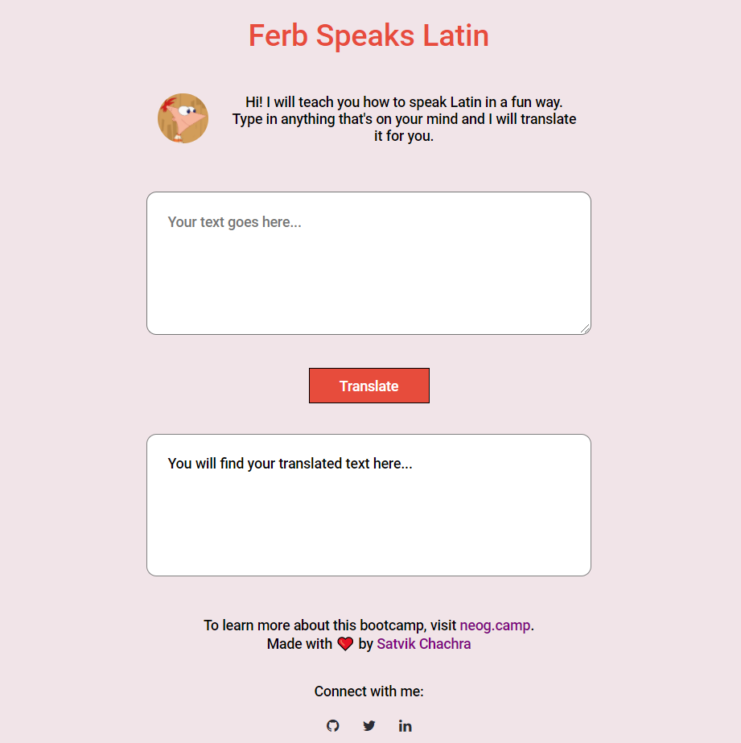

# Ferb-Speaks-Latin

* Talk like Phineas and Ferb with this handy English-to-Ferb Latin Translator Web App.
* A part of submission of an assignment for neogcamp.

### View Live Demo
<pre><a href="https://satvikchachra-ferb-speaks-latin.netlify.app/"><b>satvikchachra-ferb-speaks-latin.netlify.app</b></a></pre>

### Features
* Translates English to Ferb Latin.
* Error Handling

### Image

  
Landing Page

    

During their routine summer fun, the two brothers Phineas and Ferb create their own language.
 
 
This website illustrates the use of <b>Fetch API.</b>
 
 
Have fun playing!
 
"Well, if by that you mean we should create a whole new form of communication, then I couldn't agree more!' - <b>Phineas Flynn</b>

##### Built with ♥ by <a href="https://github.com/satvikchachra">satvikchachra</a>

